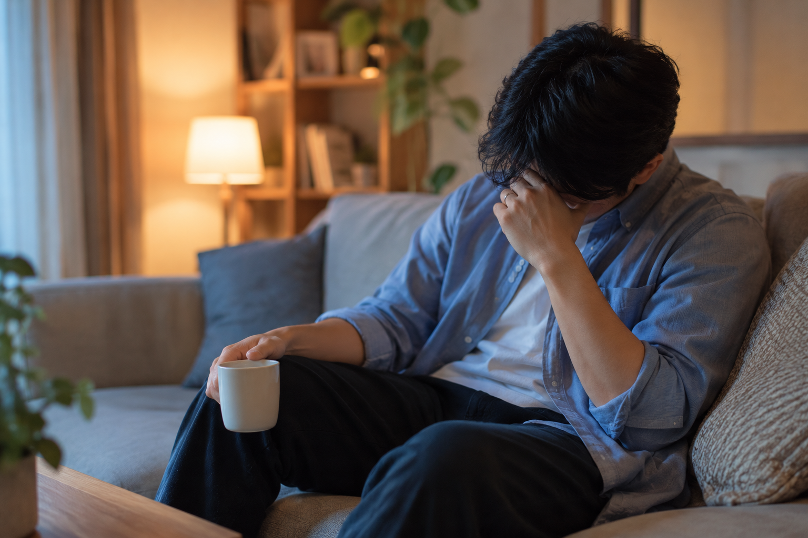
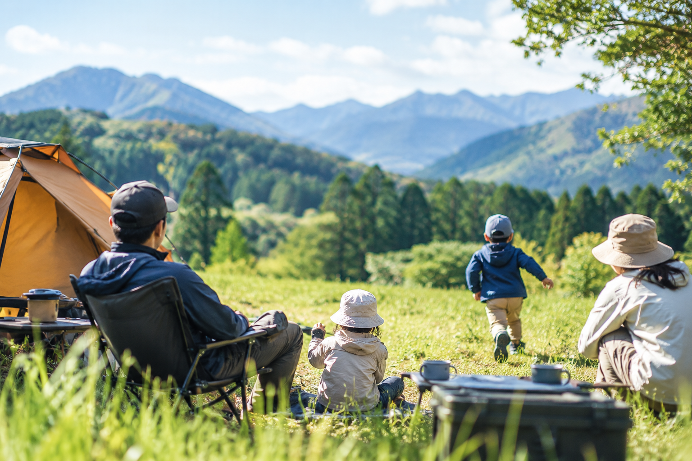

休日が終わった後、「一日休んだはずなのに、なぜか何も残っていない」と感じたことはないでしょうか。

朝から子どもの相手をして、公園へ行き、買い物を済ませ、気付けば夕方。家族との時間は大切だったはずなのに、自分自身は何もできなかったような感覚だけが残る。

子育て中のパパにとって、休日は自由時間ではありません。だからこそ大切なのが「休日の型」です。

休日に決まった流れを持つことで、家族との時間を楽しみながら、自分自身の時間も確保しやすくなります。

今回は、子育て中のパパにこそおすすめしたい「休日の型」についてお話しします。

## なぜ子育てパパの休日は疲れるのか

子どもが小さいうちは、一日の主導権を子どもが握っています。

朝早く起こされ、公園に連れて行き、お腹が空いたと言われ、お昼寝のタイミングを考えながら過ごす。予定通りに進まないことも日常です。

問題なのは忙しいことではありません。

「今日はどうしようか」
「どこに行こうか」
「何をして過ごそうか」
と、その場その場で考えていることです。

家族全員がノープランのまま休日を迎えると、判断ばかりが増えていきます。

人は選択や判断を繰り返すほど疲れると言われています。

結果的に、

ダラダラ過ごしてしまう
無駄に移動が増える
子どもも退屈する
パパもママも疲れる

という状態になりがちです。

子育て中の休日に必要なのは気合いや根性ではありません。

家族が動きやすくなる「型」なのです。

## 休日に型を持つ3つのメリット

休日に型を作ると、家族にとってもパパ自身にとっても良い変化が生まれます。まずは代表的な3つのメリットを見ていきましょう。

### ① 家族の満足度が上がる

休日の流れがある程度決まっていると、家族全員が動きやすくなります。

例えば、

午前中は外遊び
昼は家でゆっくり
午後は家族時間

という流れがあるだけで、「次は何をするの？」が減ります。

特に小さな子どもは生活のリズムがある方が機嫌よく過ごせます。

休日の型は、家族全員のストレスを減らしてくれるのです。

### ② パパ自身の時間を確保できる

子育て中は、つい自分のことを後回しにしてしまいます。

読書をしたい。
運動をしたい。
趣味を楽しみたい。

そう思っていても、いつの間にか一日が終わっていることは珍しくありません。

しかし、休日のどこかに「パパの時間」を組み込んでおけば話は変わります。

30分でも構いません。

あらかじめ確保しておくことで、自分自身を整える時間が生まれます。

### ③ 月曜日が楽になる

休日の目的は、頑張ることではありません。

心と体を整え、また家族との日常を楽しむためのエネルギーを回復することです。

休日が慌ただしく終わると、月曜日の朝から疲れが残ります。

反対に、適度に体を動かし、家族と楽しい時間を過ごし、自分の時間も確保できた休日は充実感が残ります。

良い休日は、良い一週間につながります。

## 子育て家庭向けの休日ルーティン例

休日の型は人それぞれですが、まずはシンプルな形から始めるのがおすすめです。ここでは、子育て家庭が取り入れやすいシンプルな休日ルーティンの例をご紹介します。

### 午前：家族で活動する時間

小さな子どもは午前中が最も元気です。

だからこそ、外遊びやお出かけは午前中に集中させます。

例えば、

公園で遊ぶ
散歩する
自転車に乗る
動物園や水族館へ行く

などです。

午前中にしっかり体を動かすと、子どもも満足しやすくなります。

パパも運動不足の解消になります。

休日の成功は午前中で決まると言っても過言ではありません。

### 昼：ゆっくり休む時間

午後まで全力で動き続ける必要はありません。

昼食後は、

お昼寝
おうち映画
絵本タイム
ボードゲーム

など、ゆっくり過ごせる時間を作りましょう。

予定を詰め込みすぎると、家族全員が疲れてしまいます。

休む時間も休日の大切な予定です。

### 午後：パパの時間を確保する

子どもがお昼寝している間や、夫婦で交代できる時間を活用しましょう。

長時間である必要はありません。30分から1時間でも十分です。

読書
筋トレ
ブログ執筆
勉強
趣味

など、自分が満たされる時間に使います。

子どもに優しく接するためにも、パパ自身が満たされていることは意外と大切です。

### 夜：家族で振り返る時間

夜は頑張らなくて大丈夫です。

家族で食事をしながら、

「今日何が楽しかった？」
「また行きたい場所はある？」

そんな話をするだけで十分です。

子どもの何気ない言葉から、意外な発見があることもあります。

穏やかな気持ちで休日を終えることで、翌日への不安も減っていきます。

## 完璧な休日を目指さない

子育て中は予定通りになりません。

子どもが体調を崩す日もあります。
天気が悪い日もあります。
機嫌が悪くて外出できない日もあります。

予定が崩れたからといって休日がダメになるわけではありません。むしろ、型があることによって、柔軟に調整しやすくなります。

家族に合わせて柔軟に変えられることも、良い型の条件です。

## 子どもが小さい今だけの休日を大切にしよう

子どもと一緒に公園へ行く時間。
手をつないで散歩する時間。
一緒に絵本を読む時間。

そんな休日は永遠には続きません。

数年後には友達と遊ぶ時間が増え、親と過ごす時間は少しずつ減っていきます。

だからこそ、今の休日を大切にしたいものです。

休日に型を持つことは、自分を縛ることではありません。

本当に大切なことに時間を使うための工夫です。

家族との時間も、自分自身の時間も、どちらも諦める必要はありません。

まずは次の休日から、

「午前は家族で活動する」
「午後に少しだけ自分時間を作る」

そんな小さな型を試してみてください。

きっと休日の終わりに感じる満足感が、これまでとは少し変わっているはずです。
