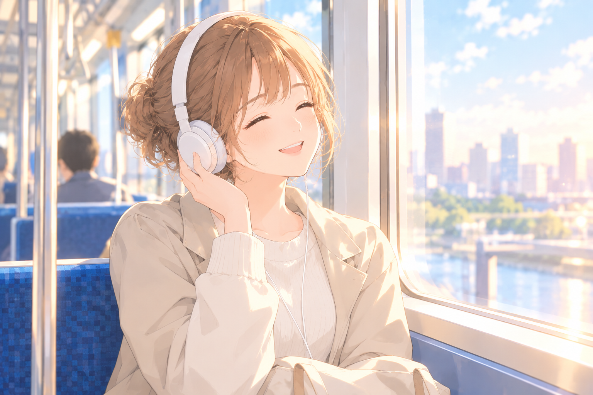
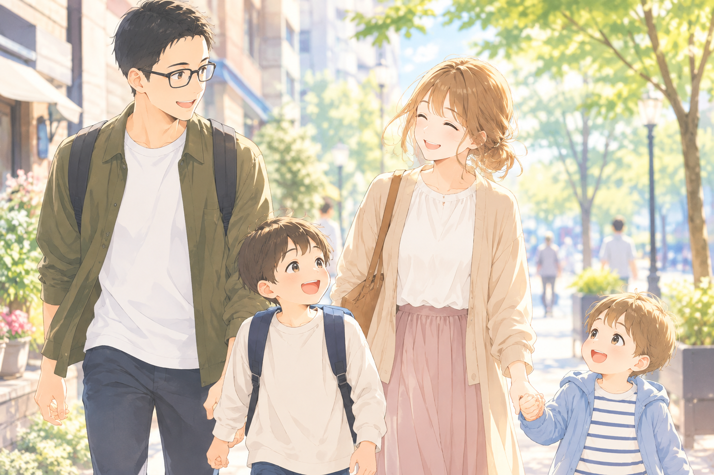

一週間が終わるころ、身体は家に帰っているのに、頭の中ではまだ仕事が続いている。返していないメール、月曜日の会議、うまくいかなかった会話。ソファに座っていても、気持ちだけが職場に置き去りのまま、ということがあります。

そんなとき、玄関で妻が「おつかれさま」と声をかけてくれる。たったひと言でも、「今週はここまで」と肩の力が抜けることがある。誰かに頑張りを見てもらえたと感じることは、仕事から家庭へ移るための、やさしい合図になります。

もちろん、家族にいつも迎えてもらえるとは限りません。妻にも一週間があり、家の中が慌ただしい日もあるでしょう。「言ってくれるはず」と期待するのではなく、「このひと言があると切り替えやすいんだ」と伝えてみる。こちらからも「今週もおつかれさま」と返す。労いを一方通行にしないことが、家の中に安心できる帰宅の習慣をつくります。

## 気持ちを切り替えるスイッチは、ひとつでなくていい

仕事のことを考えないようにしよう、と力むほど、かえって仕事が頭に浮かぶことがあります。仕事から離れるには、気合いで忘れるより、「これをしたら一区切り」とわかる行動をいくつか用意しておくほうが現実的です。仕事から心理的に距離を取ることや、くつろぎ、自分で余暇を選べる感覚は、仕事後の回復を考える研究でも取り上げられています。

自分に合いそうなものを、ひとつ試すだけで十分です。

- **帰る前に、明日の自分へメモを残す。** 終わったこと、次にやること、気がかりを短く書く。「忘れないように考え続ける」役目を、紙やメモアプリに渡します。
- **通勤の最後に、いつもの一曲を聴く。** あるいは駅から家まで少し歩く。仕事の時間と家の時間の間に、短い移動の儀式を挟みます。
- **玄関に入る前、息をゆっくり吐く。** 深呼吸を何度も頑張る必要はありません。ドアの前でひと息つき、「今日はここまで」と心の中で区切るだけでも合図になります。
- **着替える、手を洗う、シャワーを浴びる。** 仕事着から部屋着へ変えるように、体の感覚を使って場面を移します。帰宅後すぐに全部の用事へ飛び込まず、数分だけ着替えの時間を取るのも手です。
- **仕事の通知を週末のあいだ遠ざける。** 可能なら通知を切る、アプリをホーム画面から外す。緊急連絡への対応が必要な仕事なら、確認する時間や連絡方法を決めておき、何度も画面を見続けない形を探します。
- **好きな飲み物や音楽を、帰宅後の合図にする。** コーヒーでもお茶でも、短いストレッチでも。豪華なご褒美でなくてかまいません。「この時間は仕事の続きではない」と思えることが大事です。
- **家族に今日のモードをひと言伝える。** 「帰ってすぐ十分だけぼーっとしたい」「少し休んだら一緒にやるね」と言葉にする。黙って距離を取るより、家族も見通しを持ちやすくなります。

大切なのは、これを全部やることではありません。ひとつ試して、しっくりくるものを残せばいい。帰宅後に子どもの「遊ぼう！」が待っている日もあるでしょう。そんな日は、長い休憩を確保できなくても、手洗いのあとに一度目を見て返事をする、抱きしめる、名前を呼ぶ。その短い瞬間を、仕事から家族へ気持ちを向け直す合図にしてもいいのです。

## 週末を「取り返す時間」にしない

平日にできなかったことを、土日に全部片づけようとすると、休みがもう一週間の勤務日のようになってしまいます。家事や育児は待ってくれないけれど、週末の予定を埋め尽くす必要もありません。

土曜の朝に、家族で「今日どう過ごしたい？」と短く相談してみる。買い物や用事をひとつにまとめる。パパが子どもを見る時間と、ママがひとりで過ごす時間を交代でつくる。家族の事情によっては、まとまった自由時間が難しいこともあります。そんなときは、まず30分でも、お互いに休める時間を予定として見える形にしてみてください。「余裕ができたら休む」では、余裕はなかなかやってきません。

休むことは、何もしないことだけではありません。昼寝をする、近所を歩く、趣味に触れる、家族と食卓を囲む。自分で選んだ過ごし方に気持ちが向くなら、それも休息です。反対に、家族と出かけるのが楽しい日もあれば、静かにひとりで過ごしたい日もある。どちらが正しいという話ではありません。

「今週もおつかれさま」と言ってもらうことを、楽しみにしていい。言葉がなかった日も、頑張りが消えるわけではありません。妻にも子どもにも、それぞれの一週間があるから、ねぎらいはお互いに渡し合うもの。うまく切り替えられない夜があっても、自分を責めずに、今できる小さな合図をひとつ選びましょう。

今週を乗り切ったパパたちへ。仕事を完璧に忘れられなくても大丈夫です。通知を閉じる、湯船につかる、家族に「おつかれさま」と伝える。そんな小さなスイッチを押しながら、この週末は少しずつ仕事から離れていけますように。
